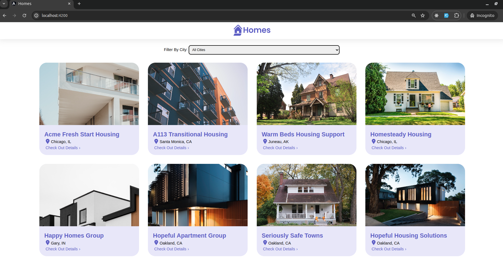
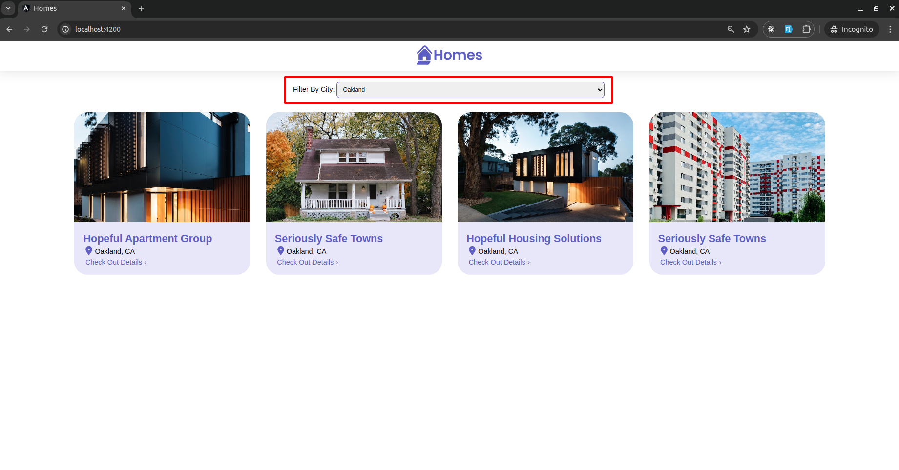
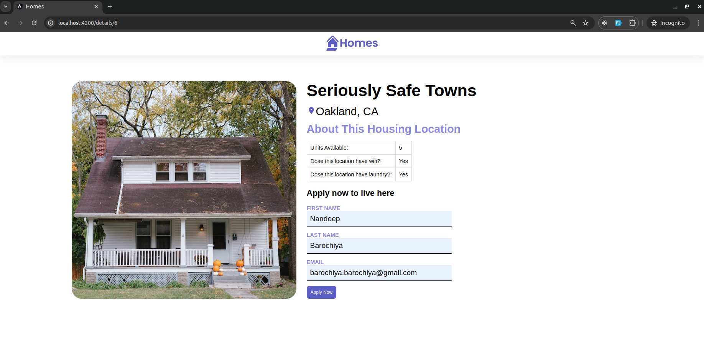

# Angular Homes App

This project provides a solid foundation for building your Angular application. It includes a sample JSON server to simulate backend data and a basic Angular setup.

## Prerequisites

Before diving in, ensure you have the following installed on your system:

- **Node.js (including npm):** <https://nodejs.org/en>
  - Node.js is a JavaScript runtime environment essential for running JavaScript applications outside of a web browser. It also includes the npm (Node Package Manager) for managing dependencies.

## Setup Instructions

Follow these step-by-step instructions to get your project up and running:

**1. Install `json-server` Globally:**

- Open your terminal and execute this command to install `json-server` globally:

  ```bash
  npm install -g json-server
  ```

- This makes the `json-server` command accessible from anywhere on your system.

**2. Start the JSON Server:**

- Once `json-server` is installed, navigate to your project's root directory in the terminal.
- Start the JSON server by watching your `db.json` file (replace `db.json` with the actual filename if different):

  ```bash
  json-server --watch db.json
  ```

- This command starts a local server at `http://localhost:3000` where you can access the data stored in your `db.json` file. You can verify this by opening the URL in your web browser.

**3. Install Angular (if not already installed):**

- If you haven't installed Angular yet, execute this command in your terminal:

  ```bash
  npm install -g @angular/cli
  ```

- This installs the Angular CLI (Command Line Interface) globally, providing tools for creating and managing Angular projects.

**4. Clone the Project Repository:**

- Assuming you have Git installed and configured, use the following command to clone the project repository (replace the URL with the actual repository):

  ```bash
  git clone https://github.com/Nandeep2750/angular-housing-demo.git
  ```

**5. Navigate to the Project Directory:**

- Change your terminal's working directory to the newly created `homes-app` directory:

  ```bash
  cd homes-app
  ```

**6. Install Project Dependencies:**

- Install the project's necessary dependencies using npm:

  ```bash
  npm install
  ```

- This command downloads and installs the packages listed in the project's `package.json` file, which are essential for its functionality.

**7. Run the Angular Application:**

- Start the development server and run the application:

  ```bash
  ng serve
  ```

- The Angular CLI typically starts the application by default on `http://localhost:4200` in your web browser. You can view your application running and make live changes to the code to see the results immediately.

## Additional Notes

- Remember to replace `db.json` with the actual filename of your JSON data file in step 2.
- If you encounter any issues during the setup process, refer to the official documentation for Node.js, `json-server`, Angular, and npm for troubleshooting steps.

## User Interface Preview

Here are some screenshots of the Angular application's output:

### List Of All Locations



### Filtered Locations



### Location Details


